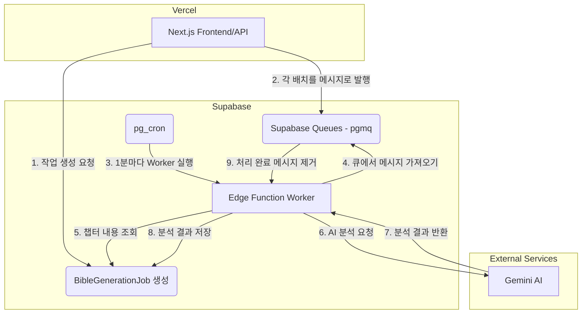

# TransNovel 백엔드 분할 전략 제안서

**작성일:** 2026년 2월 3일
**작성자:** Manus AI

## 1. 제안 배경

지난 '설정집 분석 로직 심층 분석 보고서'에 이어, 본 제안서는 **백엔드 아키텍처를 근본적으로 분할**하여 대규모 작품 처리의 확장성과 안정성을 극대화하는 방안에 대해 논의합니다. 현재의 Next.js 모놀리식(Monolithic) 구조에서 리소스 소모가 큰 '설정집 분석' 워크로드를 별도의 서비스로 분리하는 전략을 중점적으로 다룹니다.

## 2. 백엔드 분할의 목표

백엔드 분할의 핵심 목표는 다음과 같습니다.

-   **관심사의 분리 (Separation of Concerns):** 사용자 요청을 처리하는 프론트엔드/API 서버와, 장시간 실행되는 백그라운드 작업을 처리하는 워커(Worker)를 분리합니다.
-   **안정성 향상:** 백그라운드 작업의 오류나 과부하가 전체 서비스(API, 웹사이트)에 영향을 미치는 것을 방지합니다.
-   **독립적인 확장:** 각 서비스의 요구사항에 맞게 리소스를 독립적으로 확장합니다. 예를 들어, 설정집 분석 작업이 많을 때만 워커의 처리량을 늘릴 수 있습니다.

## 3. 백엔드 분할 전략 비교 분석

현재 아키텍처와 Vercel/Supabase 생태계 내에서 구현 가능한 세 가지 주요 분할 전략을 비교 분석했습니다.

### 전략 A: 최적화된 모놀리식 (Optimized Monolith) - 현재 구조 개선

-   **설명:** 현재의 Next.js 단일 프로젝트 구조를 유지하되, Vercel Cron Job의 실행 시간 연장 및 배치 크기 조절 등 이전 보고서에서 제안된 최적화를 적용하는 방식입니다. 엄밀한 의미의 '분할'은 아니지만, 안정성을 높이는 현실적인 대안입니다.

### 전략 B: 논리적 분할 (Logical Split) - Supabase Edge Function 활용

-   **설명:** 설정집 분석 로직을 Vercel 서버리스 함수가 아닌 **Supabase Edge Function**으로 이전합니다. 작업 생성 API가 호출되면, 데이터베이스 트리거(DB Trigger)나 간단한 API 호출을 통해 Supabase Edge Function을 실행시켜 분석을 위임하는 구조입니다. 이는 실행 환경(Vercel Node.js vs Supabase Deno)을 분리하는 논리적 분할에 해당합니다.

### 전략 C: 완전 분리 (Full Decoupling) - Supabase Queues 활용 (강력 권장)

-   **설명:** **Supabase Queues (pgmq)**를 도입하여 생산자(Producer)와 소비자(Consumer) 패턴을 구현하는 가장 진보된 아키텍처입니다. Next.js API는 '작업을 큐에 추가'하는 역할만 담당하고, 실제 분석은 큐에서 작업을 꺼내 처리하는 별도의 워커가 전담합니다.

### 비교 분석표

| 구분 | 전략 A (최적화된 모놀리식) | 전략 B (논리적 분할) | 전략 C (완전 분리 - Queues) |
| :--- | :--- | :--- | :--- |
| **아키텍처** | 단일 Next.js 프로젝트 | Next.js + Supabase Edge Functions | Next.js (Producer) + Supabase Queues + Worker (Consumer) |
| **확장성** | 낮음 (전체 프로젝트 단위로만 확장) | 중간 (Edge Function 독립적 실행) | **높음** (Worker 수 조절로 처리량 동적 제어) |
| **안정성** | 중간 (타임아웃 위험 상존) | 중간 (Edge Function 자체 제한 존재) | **높음** (작업 실패 시 자동 재시도, 서비스 간 영향 없음) |
| **복잡도** | 낮음 (기존 코드베이스 유지) | 중간 (새로운 실행 환경 및 Deno 학습 필요) | 높음 (큐, 워커 등 새로운 개념 도입) |
| **구현 방식** | Vercel Cron Job | DB Trigger → Supabase Edge Function | API → Supabase Queue → Worker |
| **총 처리 시간** | 동일 | 동일 | **단축 가능** (병렬 워커 실행 시) |

## 4. 권장 아키텍처: Supabase Queues와 Edge Function Worker의 결합

분석 결과, 장기적인 확장성과 안정성을 위해 **전략 C: Supabase Queues를 활용한 완전 분리 아키텍처**를 강력히 권장합니다. 이 구조는 현재 TransNovel이 직면한 대규모 데이터 처리 문제를 가장 이상적으로 해결할 수 있습니다.

### 4.1. 권장 아키텍처 다이어그램

### 4.2. 상세 실행 흐름

1.  **작업 생성 (Producer - Next.js API):**
    -   사용자가 설정집 생성을 요청하면, 기존과 같이 `BibleGenerationJob` 레코드를 생성합니다.
    -   하지만 `batchPlan` JSON을 저장하는 대신, 분석할 챕터 묶음(배치)을 **개별 메시지**로 만들어 Supabase Queue에 `send_batch` 함수를 사용해 한 번에 삽입합니다.
    -   각 메시지에는 `jobId`와 `chapterNumbers` 배열이 포함됩니다.

2.  **작업 처리 (Consumer - Supabase Edge Function Worker):**
    -   별도의 Supabase Edge Function(`bible-generation-worker`)을 생성합니다. 이 함수는 큐에서 메시지를 꺼내 AI 분석을 수행하고 결과를 DB에 저장하는 역할만 담당합니다.
    -   **Supabase Cron (`pg_cron`)**을 사용해 1분마다 이 워커 함수를 주기적으로 호출합니다.
    -   워커가 실행되면, 큐에서 `read` 또는 `pop` 함수를 사용해 처리할 메시지를 여러 개(예: 5-10개) 가져옵니다.
    -   가져온 메시지들을 `Promise.all` 등을 사용해 병렬로 처리하여 AI 분석 및 DB 저장을 수행합니다.
    -   처리가 성공적으로 완료된 메시지는 큐에서 `delete` 또는 `archive` 함수를 호출하여 제거합니다.

### 4.3. 기대 효과

-   **Vercel 타임아웃 문제 완전 해결:** Vercel API는 단순히 메시지를 큐에 넣고 즉시 응답하므로, 타임아웃 위험이 없습니다. 실제 작업은 Supabase 내에서 비동기적으로 처리됩니다.
-   **뛰어난 내결함성:** `pgmq`는 특정 시간 내에 처리가 완료되지 않은 메시지를 다시 큐로 되돌리는 '가시성 타임아웃(Visibility Timeout)' 기능을 제공합니다. 워커가 처리 중 실패하더라도 작업이 유실되지 않고 자동으로 재시도됩니다.
-   **유연한 확장성:** 향후 작업량이 폭증할 경우, `pg_cron`의 실행 주기를 단축하거나, 여러 워커를 동시에 실행시키는 등의 전략을 통해 처리량을 손쉽게 늘릴 수 있습니다.
-   **관심사의 명확한 분리:** Next.js 프로젝트는 사용자 인터랙션과 핵심 비즈니스 로직에만 집중할 수 있게 되며, 무거운 백그라운드 작업은 Supabase 인프라에 완전히 위임됩니다.

## 5. 결론

백엔드를 분할하는 것은 단순히 기술적인 개선을 넘어, TransNovel 플랫폼이 미래의 성장에 대비하는 중요한 전략적 결정입니다. 현재의 모놀리식 구조를 최적화하는 것도 단기적인 해결책이 될 수 있지만, **Supabase Queues를 도입하여 백엔드를 완전히 분리하는 아키텍처**로 전환하는 것이 장기적인 안정성과 확장성을 보장하는 최선의 길입니다.

초기 구현 복잡도는 다소 높을 수 있으나, Supabase가 제공하는 강력한 Postgres 네이티브 기능들을 활용하면 예상보다 원활하게 전환이 가능할 것입니다. 이 아키텍처는 TransNovel이 수만, 수십만 회차의 초대규모 작품도 안정적으로 처리할 수 있는 견고한 기반이 될 것입니다.

## 6. 참고 자료

-   [1] Supabase Blog: [Supabase Queues](https://supabase.com/blog/supabase-queues)
-   [2] Supabase Docs: [Background Tasks](https://supabase.com/docs/guides/functions/background-tasks)
-   [3] Supabase Docs: [Cron Jobs](https://supabase.com/docs/guides/cron)
-   [4] Supabase Docs: [Edge Functions Limits](https://supabase.com/docs/guides/functions/limits)
